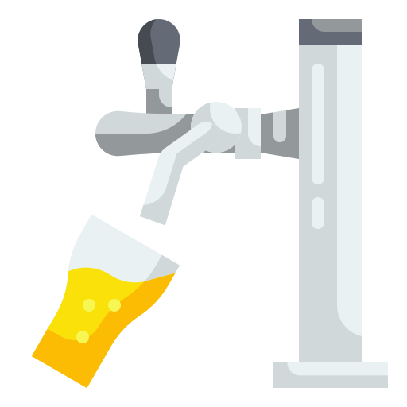

# DRAFT - Distributed Relay and Automation Facilitation Tool


draft is a project designed to help test [IPA](https://github.com/private-attribution/ipa) at scale. It contains 2 components:

1. draft-server: a web front end and service that starts queries an displays logs from the MPC helper servers
2. draft-sidecar: a sidecar back end API that runs next to the IPA binary on helper servers. this include a CLI for setup and running.

## Get started

### Local Dev

Requirements:
1. Python 3.11
2. Node 20


Setup:

```
#Clone this repo
git clone https://github.com/eriktaubeneck/draft.git
cd draft

# install helper-cli
python -m virtualenv .venv
source .venv/bin/activate
pip install --editable .

# start dev environment
draft start-local-dev
```


## Credit
[Beer tap icons created by wanicon - Flaticon]("https://www.flaticon.com/free-icons/beer-tap")
